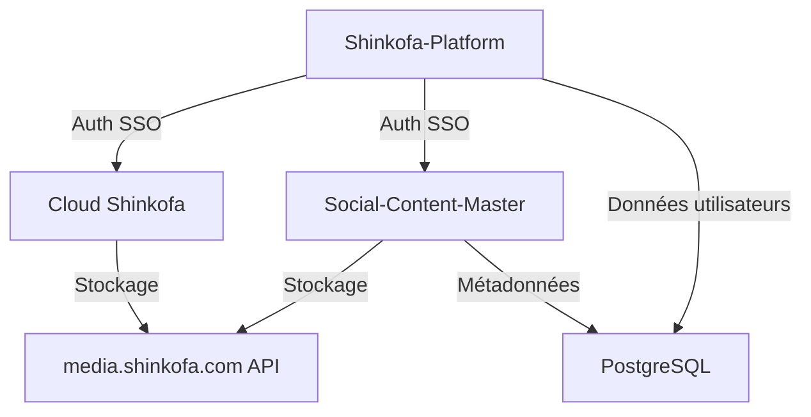

# Roadmap Shinkofa 2026

> Timeline détaillée produits & features par trimestre.

**Créé** : 2026-01-27
**Statut** : 🚧 En construction
**Sync avec** : [Master Plan](./MASTER-PLAN.md), [Projects Registry](../Projects-Registry.md)

---

## 📅 2026 Q1 (Janvier - Mars)

### 🎯 Objectifs Trimestre

- [ ] MVP Shinkofa-Platform opérationnel
- [ ] Premiers **[NOMBRE]** clients coaching payants
- [ ] Fondations business solides (juridique, branding, process)

---

### Shinkofa-Platform (app.shinkofa.com)

**Priorité** : 🔥 CRITIQUE

**Features** :
- [x] Déploiement alpha (déjà fait)
- [ ] Système authentification complet (OAuth + email/password)
- [ ] Dashboard client personnalisé
- [ ] Système réservation sessions coaching
  - Calendrier disponibilités Jay
  - Booking client avec confirmation auto
  - Rappels email J-1
- [ ] Intégration paiement Stripe
  - Paiement unique session
  - Paiement packages (3, 6, 12 sessions)
  - Facturation automatique
- [ ] Espace ressources client
  - Documents Design Humain téléchargeables
  - Historique sessions
  - Notes partagées coach/client
- [ ] Pages marketing SEO
  - Landing page coaching
  - Page tarifs
  - Blog intégré (CMS headless ou Markdown)

**Tech Stack** :
- Frontend : Next.js 14 (App Router)
- Backend : API Routes Next.js
- DB : PostgreSQL + Prisma
- Auth : NextAuth.js
- Payments : Stripe
- Hosting : Vercel ou VPS OVH

**Owner** : Jay + Claude Code

**Timeline** :
- Semaine 1-2 : Auth + Dashboard
- Semaine 3-4 : Booking system
- Semaine 5-6 : Stripe intégration
- Semaine 7-8 : Espace ressources + SEO pages

---

### Social-Content-Master (studio.shinkofa.com)

**Priorité** : 🔥 HAUTE

**Features Sprint 2** :
- [x] Sprint 1 : Édition vidéo basique (déjà fait)
- [ ] Export multi-formats (MP4, MOV, WebM)
- [ ] Templates podcast prédéfinis
  - Intro/Outro automatique
  - Lower thirds (sous-titres nom/titre)
  - Transitions standards
- [ ] Transcription automatique (Whisper API)
- [ ] Bibliothèque assets (musiques, effets)
- [ ] Preview temps réel

**Tech Stack** :
- Frontend : Next.js + React
- Video Processing : FFmpeg (backend)
- Storage : media.shinkofa.com API
- Hosting : VPS OVH

**Owner** : Jay + Claude Code

**Timeline** :
- Semaine 1-3 : Export + templates
- Semaine 4-6 : Transcription AI
- Semaine 7-8 : Bibliothèque assets

---

### Contenu & Marketing

**Priorité** : 🔥 HAUTE

**Podcast The Ermite** :
- [ ] **[NOMBRE]** épisodes minimum (1/semaine ou rythme Jay)
- [ ] CTA Shinkofa dans chaque épisode
- [ ] Landing page podcast avec formulaire capture email

**Blog Shinkofa** :
- [ ] **[NOMBRE]** articles SEO
  - "Qu'est-ce que le Design Humain ?"
  - "Multipotentiel : Force ou Handicap ?"
  - "Comment Gérer son Énergie en tant que Projecteur"
  - "Reconversion Professionnelle Multipotentiel"
  - <!-- À COMPLÉTER : Autres sujets SEO -->
- [ ] Newsletter hebdomadaire lancée

**Réseaux Sociaux** :
- [ ] LinkedIn : **[NOMBRE]** posts/semaine
- [ ] Instagram (optionnel) : **[NOMBRE]** posts/semaine

---

### Business & Légal

**Priorité** : ⚙️ MOYENNE

- [ ] Identité visuelle finalisée
  - Logo Shinkofa définitif
  - Charte graphique (couleurs, typo, style)
  - Templates slides/documents
- [ ] Statut juridique clarifié
  - Auto-entrepreneur ou SASU/EURL ?
  - Déclaration activité
  - Assurance RC Pro
- [ ] RGPD conformité
  - Politique confidentialité
  - CGU/CGV
  - Consentement cookies
- [ ] Process onboarding client documenté
  - Questionnaire pré-session
  - Contrat coaching
  - Workflow post-session

---

## 📅 2026 Q2 (Avril - Juin)

### 🎯 Objectifs Trimestre

- [ ] **[NOMBRE]** clients actifs
- [ ] Première formation en ligne lancée
- [ ] Début automatisation (emails, booking)

---

### Shinkofa-Platform v2

**Features** :
- [ ] Plateforme formations intégrée
  - Hébergement vidéos (Vimeo/Bunny CDN)
  - Progression tracking
  - Quiz interactifs
  - Certificats auto-générés
- [ ] Espace communauté (forum ou Discord embed)
- [ ] Intégration email marketing (Mailchimp/Brevo)
  - Séquences automatiques bienvenue
  - Nurturing leads
  - Rappels abandons panier

**Timeline** :
- Semaine 1-4 : Plateforme formations
- Semaine 5-8 : Communauté + email automation

---

### Formation 1 : "Design Humain pour Multipotentiels"

**Priorité** : 🔥 HAUTE

**Livrables** :
- [ ] Script complet (10 modules)
- [ ] Enregistrement vidéos (setup home studio)
- [ ] Workbook PDF interactif
- [ ] Landing page vente
- [ ] Séquence emails promo

**Timeline** :
- Semaine 1-3 : Écriture script
- Semaine 4-6 : Enregistrement
- Semaine 7-8 : Montage + landing page

**Prix** : **[MONTANT À DÉFINIR]** €

---

### Marketing Q2

**Campagnes** :
- [ ] Lancement formation (promo early bird)
- [ ] Test publicité Meta Ads (budget 500 €)
- [ ] 2 webinaires gratuits (acquisition leads)
- [ ] Partenariats : **[NOMBRE]** collaborations

**Blog** :
- [ ] **[NOMBRE]** articles SEO supplémentaires
- [ ] Guest posts sur sites partenaires

---

## 📅 2026 Q3 (Juillet - Septembre)

### 🎯 Objectifs Trimestre

- [ ] **[NOMBRE]** clients actifs
- [ ] Abonnement mensuel lancé
- [ ] Formation 2 en production

---

### Shinkofa-Platform v3

**Features** :
- [ ] Abonnement mensuel (communauté premium)
  - Accès exclusif webinaires live
  - Bibliothèque ressources complète
  - Support prioritaire
- [ ] Mobile responsive optimisé
- [ ] Analytics tableau de bord Jay
  - Revenus temps réel
  - Taux conversion funnel
  - Engagement clients

---

### Formation 2 : "Construire sa Carrière Multipotentiel"

**Priorité** : ⚙️ MOYENNE

**Livrables** :
- [ ] Script 12 modules
- [ ] Enregistrement
- [ ] Templates carrière (CV, portfolio, pitch)
- [ ] Landing page

**Timeline** : Semaines 1-8

---

### Social-Content-Master v2 (Préparation SaaS)

**Features** :
- [ ] Multi-utilisateurs (comptes séparés)
- [ ] Stockage cloud par utilisateur (quota)
- [ ] Templates marketplace (utilisateurs partagent)
- [ ] Pricing page + checkout

**Timeline** : Semaines 5-12 (continue Q4)

---

## 📅 2026 Q4 (Octobre - Décembre)

### 🎯 Objectifs Trimestre

- [ ] MRR : **[MONTANT]** €
- [ ] Lancement Social-Content-Master SaaS (beta)
- [ ] Bilan annuel + plan 2027

---

### Social-Content-Master SaaS Beta

**Priorité** : 🔥 HAUTE

**Lancement** :
- [ ] Beta privée (20 early adopters)
- [ ] Feedback & itérations
- [ ] Lancement public (studio.shinkofa.com)

**Pricing** : **[MONTANT]** € /mois (ou **[MONTANT]** €/an)

---

### Cloud Shinkofa (Planification)

**Priorité** : ⚠️ BASSE

**Objectif Q4** :
- [ ] Specs fonctionnelles rédigées
- [ ] Maquettes UI/UX
- [ ] Décision stack technique
- [ ] Planification dev Q1 2027

---

### Marketing Q4

**Campagnes** :
- [ ] Black Friday / Cyber Monday (promos formations)
- [ ] Bilan année clients (témoignages)
- [ ] Lancement Social-Content-Master (Product Hunt, réseaux)

**Contenu** :
- [ ] Rétrospective 2026 (podcast spécial)
- [ ] Annonce roadmap 2027

---

## 📋 Backlog (Idées Futures)

### 2027+

**Produits** :
- [ ] Shizen-Koshin-MVP (IA coaching multi-agents)
- [ ] Family Hub Shinkofa (organisation familiale)
- [ ] Mobile app Shinkofa (iOS/Android)
- [ ] Certification coaches Shinkofa (programme formation)

**Expansion** :
- [ ] Version anglaise contenus (marché US/UK)
- [ ] Partenariats Québec/Belgique/Suisse
- [ ] Événements physiques (retraites, ateliers)

**Tech** :
- [ ] API publique Shinkofa (intégrations tierces)
- [ ] Marketplace templates/outils
- [ ] Programme affiliation automatisé

---

## 🔄 Révisions Roadmap

**Fréquence** : Révision fin de chaque trimestre

**Critères Ajustement** :
- Feedback clients
- Métriques business (revenus, acquisition)
- Énergie Jay (respecter rythme Projecteur)
- Opportunités imprévues (partenariats, tendances marché)

**Prochaine révision** : **[DATE FIN Q1]**

---

## 📊 Dépendances Inter-Projets

**Règle** : Shinkofa-Platform = priorité absolue (socle de tout l'écosystème).

---

## 📎 Liens Utiles

- [Master Plan](./MASTER-PLAN.md) - Vision stratégique
- [Business Plan](./BUSINESS-PLAN.md) - Modèle économique
- [Ecosystem Architecture](./ECOSYSTEM-ARCHITECTURE.md) - Architecture technique
- [Projects Registry](../Projects-Registry.md) - Tous projets Jay

---

**Dernière mise à jour** : 2026-01-27
**Statut** : 🚧 Template — À ajuster avec timeline réaliste Jay
**Owner** : Jay The Ermite
