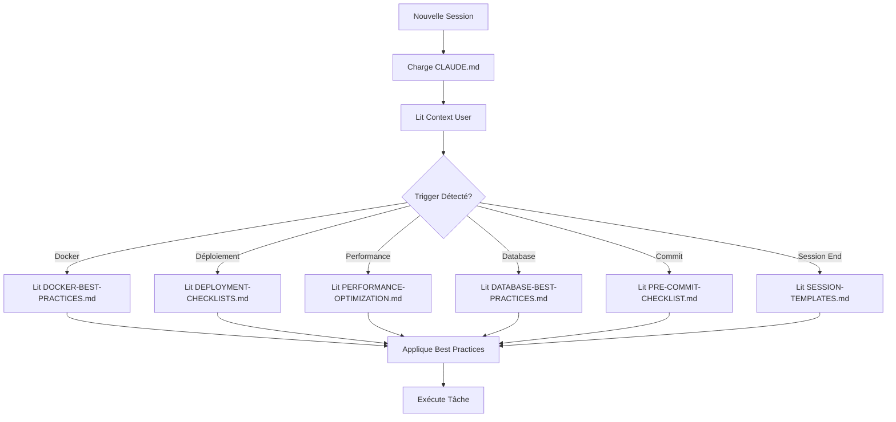

# Architecture Fichiers Instructions Claude Code

**Version** : 1.8 (Optimisée)
**Date** : 2026-01-04

---

## 📋 Vue d'Ensemble

Le fichier `CLAUDE.md` a été optimisé pour réduire la consommation de tokens de **~48,000 tokens à ~15,000-20,000 tokens** (réduction de **~60%**).

Les sections techniques volumineuses ont été **externalisées** dans des fichiers séparés avec des **triggers contextuels clairs** pour que Claude sache **QUAND** les consulter.

---

## 📁 Structure Fichiers

### Fichier Principal

**`CLAUDE.md`** (~15,000-20,000 tokens)
- Core identity & workflow quotidien
- Toujours chargé en contexte
- Contient références explicites vers fichiers externalisés

### Fichiers Techniques Externalisés

Ces fichiers sont consultés **à la demande** selon le contexte :

| Fichier | Tokens (approx) | Trigger Contextuel |
|---------|-----------------|-------------------|
| `DOCKER-BEST-PRACTICES.md` | ~2,500 | Si Docker/containers mentionnés dans conversation |
| `DEPLOYMENT-CHECKLISTS.md` | ~2,000 | Avant déploiement VPS ou o2Switch |
| `PERFORMANCE-OPTIMIZATION.md` | ~1,500 | Si problème performance ou optimisation demandée |
| `DATABASE-BEST-PRACTICES.md` | ~2,000 | Si travail base de données, migrations, queries |
| `PRE-COMMIT-CHECKLIST.md` | ~1,000 | Avant chaque commit (vérification qualité) |
| `SESSION-TEMPLATES.md` | ~2,500 | Fin de session, versioning, breaking changes |

**Total externalisé** : ~11,500 tokens (disponibles à la demande)

---

## 🎯 Comment ça Fonctionne

### 1. Chargement Initial
- Claude charge **uniquement** `CLAUDE.md` au démarrage
- Consomme ~15,000-20,000 tokens au lieu de ~48,000

### 2. Consultation Contextuelle
Claude consulte les fichiers externalisés **automatiquement** quand :

**Exemple 1 - Docker** :
```
User: "J'ai un problème avec docker-compose, l'uvicorn ne reload pas"
→ Claude détecte "docker-compose" + "uvicorn"
→ Lit DOCKER-BEST-PRACTICES.md
→ Applique leçons apprises (--reload-dir, --no-cache, etc.)
```

**Exemple 2 - Déploiement** :
```
User: "Je veux déployer l'app sur le VPS"
→ Claude détecte "déployer" + "VPS"
→ Lit DEPLOYMENT-CHECKLISTS.md
→ Suit checklist VPS (HTTPS, firewall, nginx, systemd, etc.)
```

**Exemple 3 - Commit** :
```
User: "Fais un commit des changements"
→ Claude détecte "commit"
→ Lit PRE-COMMIT-CHECKLIST.md
→ Vérifie linting, tests, security, docs avant commit
```

### 3. Avantages

✅ **Performance optimale** : Moins de tokens chargés = conversations plus longues
✅ **Contexte ciblé** : Claude charge uniquement l'info pertinente
✅ **Maintenance facile** : Modifier un fichier externalisé sans toucher CLAUDE.md
✅ **Scalabilité** : Ajouter nouvelles best practices sans alourdir fichier principal

---

## 📖 Index des Triggers

**Référence rapide pour savoir QUEL fichier contient QUELLE information** :

### Docker
- Problèmes docker-compose → `DOCKER-BEST-PRACTICES.md`
- Uvicorn reload issues → `DOCKER-BEST-PRACTICES.md`
- Cache Docker → `DOCKER-BEST-PRACTICES.md`
- Container debugging → `DOCKER-BEST-PRACTICES.md`

### Déploiement
- Déployer sur VPS → `DEPLOYMENT-CHECKLISTS.md`
- Déployer sur o2Switch → `DEPLOYMENT-CHECKLISTS.md`
- HTTPS/SSL setup → `DEPLOYMENT-CHECKLISTS.md`
- Nginx config → `DEPLOYMENT-CHECKLISTS.md`

### Performance
- App lente → `PERFORMANCE-OPTIMIZATION.md`
- Optimisation frontend → `PERFORMANCE-OPTIMIZATION.md`
- Optimisation backend → `PERFORMANCE-OPTIMIZATION.md`
- Lighthouse audit → `PERFORMANCE-OPTIMIZATION.md`

### Base de Données
- Migrations Alembic/Prisma → `DATABASE-BEST-PRACTICES.md`
- Queries lentes → `DATABASE-BEST-PRACTICES.md`
- Schema design → `DATABASE-BEST-PRACTICES.md`
- Backups DB → `DATABASE-BEST-PRACTICES.md`

### Commits & Versioning
- Avant commit → `PRE-COMMIT-CHECKLIST.md`
- Versioning SemVer → `SESSION-TEMPLATES.md`
- Breaking changes → `SESSION-TEMPLATES.md`
- Session summary → `SESSION-TEMPLATES.md`

---

## 🔄 Workflow Claude



---

## 🛠️ Maintenance

### Ajouter Nouvelle Best Practice

1. Créer nouveau fichier dans `.claude/` : `NOUVELLE-BEST-PRACTICE.md`
2. Ajouter trigger dans `CLAUDE.md` section "Index Fichiers Techniques"
3. Documenter trigger dans ce README

### Modifier Best Practice Existante

1. Éditer fichier concerné (ex: `DOCKER-BEST-PRACTICES.md`)
2. Pas besoin de toucher `CLAUDE.md` (sauf si trigger change)

### Ajouter Section dans CLAUDE.md

⚠️ **Attention** : Garder `CLAUDE.md` < 20,000 tokens
- Si nouvelle section > 2,000 tokens → externaliser
- Sinon, ajouter inline dans `CLAUDE.md`

---

## 📊 Métriques Optimisation

**Avant (v1.7)** :
- `CLAUDE.md` : ~48,000 tokens
- Fichiers externalisés : 0
- Total chargé au démarrage : ~48,000 tokens

**Après (v1.8)** :
- `CLAUDE.md` : ~15,000-20,000 tokens (-60%)
- Fichiers externalisés : 6 fichiers, ~11,500 tokens
- Total chargé au démarrage : ~15,000-20,000 tokens
- **Gain** : ~28,000-33,000 tokens disponibles pour conversation

---

## 🎓 Leçons Apprises

### Pourquoi cette architecture ?

1. **Performance** : Notifications "fichier lourd impacte performance" disparaissent
2. **Scalabilité** : Facile d'ajouter nouvelles best practices sans alourdir core
3. **Maintenabilité** : Chaque fichier a un scope clair, modifications isolées
4. **Efficacité Claude** : Claude charge uniquement l'info nécessaire au contexte

### Ce qui fonctionne bien

✅ Section "Index Fichiers Techniques" avec table triggers
✅ Format `| Fichier | Trigger |` très clair pour Claude
✅ Références explicites dans CLAUDE.md ("Voir DOCKER-BEST-PRACTICES.md")
✅ Fichiers externalisés autonomes (peuvent être lus indépendamment)

### Pièges évités

❌ **Ne PAS** fragmenter trop (< 1000 tokens par fichier = overhead)
❌ **Ne PAS** créer triggers ambigus (Claude doit savoir QUAND lire)
❌ **Ne PAS** dupliquer info entre CLAUDE.md et fichiers externalisés
❌ **Ne PAS** oublier lien retour "Retour vers CLAUDE.md" dans fichiers externalisés

---

**Maintenu par** : Jay The Ermite
**Pour questions** : Consulter ce README ou `CLAUDE.md` section "Index Fichiers Techniques"
